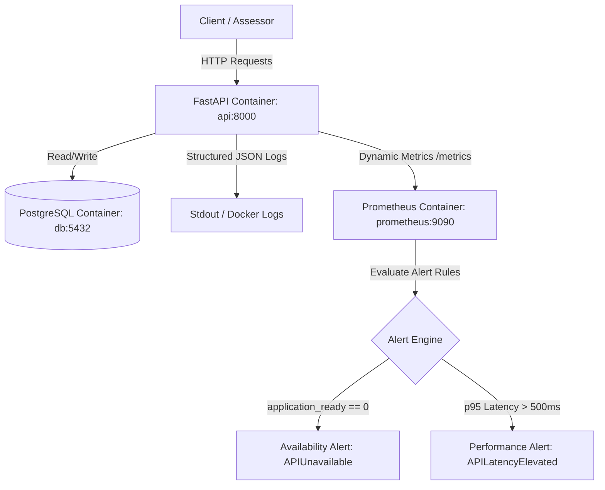

# FastAPI Book Management API

## Assessment Context

This assessment builds upon an existing personal FastAPI application. The
original application predates this assessment. The assessment work focused on
adding operational-readiness capabilities, including structured logging,
health/readiness checks, metrics, monitoring, alerting, failure simulation,
recovery validation, and operational documentation.

## SRE Technical Assessment Summary

This project implements a fully containerized, instrumented, and SRE-monitored FastAPI book collection service backed by PostgreSQL. Designed for maximum operational readiness, the service features structured JSON logging, dynamic liveness (`/health`) and readiness (`/ready`) endpoints, and custom Prometheus HTTP telemetry counters. 

To ensure rapid incident resolution, two target alerting rules evaluate availability (`APIUnavailable` triggering on readiness loss for `15s`) and latency (`APILatencyElevated` triggering when p95 request durations exceed `500ms` for `30s`). An operator-facing [Operational Runbook](file:///Users/galosikhena/Downloads/fastapi-book-project/RUNBOOK.md) guides responders through triage steps, validation completion criteria, and escalation triggers. An automated reproduction script (`scripts/simulate-db-failure.sh`) stops the database dependency to verify liveness/readiness code paths and alert transitions. Safe recovery via manual starting of the PostgreSQL service restored connectivity within 12.0s without data loss or stack rebuilds, proving resilient data persistence and pool connectivity.

### SRE Architecture Diagram



### Assessment Evidence Matrix

| Requirement | Implementation File | Verification Check | Evidence |
| :--- | :--- | :--- | :--- |
| **Structured logs** | [core/logger.py](file:///Users/galosikhena/Downloads/fastapi-book-project/core/logger.py) | Check JSON format in stdout | [logs trace](file:///Users/galosikhena/Downloads/fastapi-book-project/evidence/failure.md#4-api-error-logs) |
| **Useful metrics** | [core/metrics.py](file:///Users/galosikhena/Downloads/fastapi-book-project/core/metrics.py) | Query `/metrics` endpoint | [metrics trace](file:///Users/galosikhena/Downloads/fastapi-book-project/evidence/recovery.md#6-persistent-data-verification-existing-data-intact) |
| **Liveness probe** | `/health` in [main.py](file:///Users/galosikhena/Downloads/fastapi-book-project/main.py) | Query `/health` returns 200 OK | [health check](file:///Users/galosikhena/Downloads/fastapi-book-project/evidence/baseline.md#2-liveness-check) |
| **Readiness probe** | `/ready` in [main.py](file:///Users/galosikhena/Downloads/fastapi-book-project/main.py) | Query `/ready` returns 503 on DB stop | [readiness check](file:///Users/galosikhena/Downloads/fastapi-book-project/evidence/failure.md#3-readiness-check-correctly-registers-dependency-loss) |
| **Availability alert** | [alerts.yml](file:///Users/galosikhena/Downloads/fastapi-book-project/prometheus/alerts.yml) | Verify alert transitions to firing | [availability rules status](file:///Users/galosikhena/Downloads/fastapi-book-project/evidence/failure.md#5-prometheus-active-alert-status-alert-is-firing) |
| **Performance alert** | [alerts.yml](file:///Users/galosikhena/Downloads/fastapi-book-project/prometheus/alerts.yml) | Verify rules loaded successfully | [rules rules status](file:///Users/galosikhena/Downloads/fastapi-book-project/evidence/baseline.md#6-prometheus-active-alert-status-active-alert-status) |
| **Failure simulation** | [simulate-db-failure.sh](file:///Users/galosikhena/Downloads/fastapi-book-project/scripts/simulate-db-failure.sh) | Run `./scripts/simulate-db-failure.sh` | [simulation logs](file:///Users/galosikhena/Downloads/fastapi-book-project/evidence/failure.md) |
| **Recovery sequence** | `docker compose start db` | Run start db command | [recovery output](file:///Users/galosikhena/Downloads/fastapi-book-project/evidence/recovery.md#1-targeted-recovery-command) |
| **Validation checks** | Checklist in [RUNBOOK.md](file:///Users/galosikhena/Downloads/fastapi-book-project/RUNBOOK.md#8-validation-criteria) | Verify liveness, readiness, functional POST/GET | [recovery checks validation](file:///Users/galosikhena/Downloads/fastapi-book-project/evidence/recovery.md) |
| **SRE Runbook** | [RUNBOOK.md](file:///Users/galosikhena/Downloads/fastapi-book-project/RUNBOOK.md) | View runbook checklists | [RUNBOOK.md](file:///Users/galosikhena/Downloads/fastapi-book-project/RUNBOOK.md) |
| **Preventive improvement** | Retries in [RUNBOOK.md](file:///Users/galosikhena/Downloads/fastapi-book-project/RUNBOOK.md#15-preventive-improvement) | Documented exponential backoff | [improvement details](file:///Users/galosikhena/Downloads/fastapi-book-project/RUNBOOK.md#15-preventive-improvement) |

## Overview

This project is a RESTful API built with FastAPI for managing a book collection. It provides comprehensive CRUD (Create, Read, Update, Delete) operations for books with proper error handling, input validation, and documentation.

## SRE Operational Runbook

For operator instructions regarding database outage triage checklists, recovery validation criteria, and escalation thresholds, refer to the SRE [Operational Runbook](file:///Users/galosikhena/Downloads/fastapi-book-project/RUNBOOK.md).

## Features

- 📚 Book management (CRUD operations)
- ✅ Input validation using Pydantic models
- 🔍 Enum-based genre classification
- 🧪 Complete test coverage
- 📝 API documentation (auto-generated by FastAPI)
- 🔒 CORS middleware enabled

## Project Structure

```
fastapi-book-project/
├── api/
│   ├── db/
│   │   ├── __init__.py
│   │   └── schemas.py      # Data models and in-memory database
│   ├── routes/
│   │   ├── __init__.py
│   │   └── books.py        # Book route handlers
│   └── router.py           # API router configuration
├── core/
│   ├── __init__.py
│   └── config.py           # Application settings
├── tests/
│   ├── __init__.py
│   └── test_books.py       # API endpoint tests
├── main.py                 # Application entry point
├── requirements.txt        # Project dependencies
└── README.md
```

## Technologies Used

- Python 3.12
- FastAPI
- Pydantic
- pytest
- uvicorn

## Installation

1. Clone the repository:

```bash
git clone https://github.com/hng12-devbotops/fastapi-book-project.git
cd fastapi-book-project
```

2. Create a virtual environment:

```bash
python -m venv venv
source venv/bin/activate  # On Windows: venv\Scripts\activate
```

3. Install dependencies:

```bash
pip install -r requirements.txt
```

## Running the Application

1. Start the server:

```bash
uvicorn main:app
```

2. Access the API documentation:

- Swagger UI: http://localhost:8000/docs
- ReDoc: http://localhost:8000/redoc

## API Endpoints

### Books

- `GET /api/v1/books/` - Get all books
- `GET /api/v1/books/{book_id}` - Get a specific book
- `POST /api/v1/books/` - Create a new book
- `PUT /api/v1/books/{book_id}` - Update a book
- `DELETE /api/v1/books/{book_id}` - Delete a book

### Health Check

- `GET /healthcheck` - Check API status

## Book Schema

```json
{
  "id": 1,
  "title": "Book Title",
  "author": "Author Name",
  "publication_year": 2024,
  "genre": "Fantasy"
}
```

Available genres:

- Science Fiction
- Fantasy
- Horror
- Mystery
- Romance
- Thriller

## Running Tests

```bash
pytest
```

## Metrics

Exposes Prometheus-compatible application metrics at `GET /metrics`.

| Metric                          | What it tells an operator |
| ------------------------------- | ------------------------- |
| `http_requests_total`           | Request volume            |
| `http_request_duration_seconds` | Request latency           |
| `http_requests_errors_total`    | Failed request volume     |

### Why these metrics were selected
These three metrics directly implement the core **Google SRE Golden Signals** for request-driven services (Traffic, Latency, and Errors). They provide high-level operational visibility:
- **Traffic (`http_requests_total`)** tells us the request volume and pattern.
- **Latency (`http_request_duration_seconds`)** tells us request execution duration, supporting p95 latency aggregation via buckets.
- **Errors (`http_requests_errors_total`)** monitors 5xx status codes to report system availability and reliability.

### Design Decisions
Additional telemetry metrics (e.g. detailed memory, CPU counters, open file descriptors) and infrastructure (like Grafana agent sidecars, Alertmanager, OpenTelemetry tracing pipelines) are intentionally omitted at this stage. This keeps the deployment minimal, zero-maintenance, and focused strictly on the baseline operational readiness requirements of the application itself.


## Health vs Readiness

The application distinguishes between process liveness (health) and operational readiness.

| Endpoint  | Purpose                  | Dependency | Failure response            |
| --------- | ------------------------ | ---------- | --------------------------- |
| `/health` | Process liveness         | None       | 200 if application responds |
| `/ready`  | Ability to serve traffic | Database   | 503 if database unavailable |

### Operational Details
- **`/health` (Liveness)**: Answers if the application process is alive and responding to HTTP requests. It is kept extremely cheap and does not query the database, ensuring that transient database errors do not cause the process manager (e.g., Kubernetes, ECS, or load balancers) to prematurely kill and restart the application container.
- **`/ready` (Readiness)**: Answers if the application is currently capable of serving client requests, which requires a healthy database dependency. It executes a lightweight connectivity check.
- **Failure Status (503)**: If the database is unreachable, `/ready` returns `503 Service Unavailable` instead of `200` to notify load balancers to temporarily remove the instance from the routing pool. This avoids serving error responses to clients while allowing the process to remain alive.
- **Noisy Log Suppression**: Successful probes (`status_code < 400`) to `/health`, `/ready`, and `/metrics` are not logged individually. This avoids filling disk space with low-value, high-frequency log entries while keeping fail-state diagnostics (5xx errors) fully visible in the logs.


## Local Development & Docker Environment

### Architecture

```text
Client
  ↓
FastAPI container (api:8000)
  ↓
Database container (db:5432)
```

### Local Setup

To build and start the containerized application and its database:

1.  **Configure Environment Variables**:
    Create a local `.env` file from the example template:
    ```bash
    cp .env.example .env
    ```
2.  **Build the Application Image**:
    ```bash
    docker compose build
    ```
3.  **Start the Services**:
    Run the services in the background:
    ```bash
    docker compose up -d
    ```
4.  **Verify Liveness (`/health`)**:
    ```bash
    curl http://localhost:8000/health
    # Response: {"status": "healthy"}
    ```
5.  **Verify Readiness (`/ready`)**:
    ```bash
    curl http://localhost:8000/ready
    # Response: {"status": "ready"}
    ```
6.  **Stop the Environment**:
    Stop and remove containers while preserving data:
    ```bash
    docker compose down
    ```
7.  **Destroy the Environment and Persistent Data**:
    Stop containers and delete the associated PostgreSQL database volume:
    ```bash
    docker compose down -v
    ```

### Configuration
Configuration is managed using environment variables loaded in `core/config.py`. For local development, safe defaults are defined in `.env.example`:
*   `DATABASE_HOST`: Service name (`db`) of the database container.
*   `DATABASE_PORT`: Private port of the database service (`5432`).
*   `DATABASE_USER` / `POSTGRES_USER`: The PostgreSQL database username.
*   `DATABASE_PASSWORD` / `POSTGRES_PASSWORD`: The database connection password.
*   `DATABASE_DB` / `POSTGRES_DB`: The target database name.

### Persistence
*   **What is persisted**: All PostgreSQL database records (the books collection).
*   **Where it is persisted**: Inside a named Docker volume (`db-data`) mapped to `/var/lib/postgresql/data`.
*   **Recreation behavior**: Recreating the `api` container or running `docker compose down` followed by `docker compose up -d` will not lose any books data, as the volume is decoupled from container cycles.
*   **How to destroy data**: Run `docker compose down -v` to destroy the named volume.

### Trade-offs
*   **Docker Compose vs Kubernetes**: Docker Compose was selected instead of a heavier orchestration system (like Kubernetes or ECS) to minimize setup complexity, keep resource usage minimal on developers' local machines, and guarantee a single-command setup.
*   **Pure Python database client**: Using `pg8000` instead of a compiled client (like `psycopg2`) keeps the API Docker image tiny and builds lightning-fast without requiring binary compilation toolchains inside Alpine.

## Availability Alert

A dedicated availability alert is configured in Prometheus to detect when the FastAPI application is unable to serve traffic.

### What it detects
The alert triggers if the application is reported as "not ready" for a sustained period. This is caused by the backend database service becoming unreachable or connection checks failing.

### Metric/signal used
*   **`application_ready`** (Gauge): Reports `1.0` when database connection checks succeed, or `0.0` when connection checks fail. This metric is dynamically updated on every Prometheus scrape request at `/metrics` and on calls to `/ready`.

### Threshold and `for` duration
*   **Expression**: `application_ready == 0`
*   **For duration**: `15s` (equivalent to 3 consecutive failed scrape samples of `5s` interval).

### Why this threshold
The `15s` threshold balances early detection with alert filtering. A `0s` threshold would cause false alerts during transient networking blips or during short container restart periods. Conversely, a threshold larger than `1m` would delay operator response times for critical system outages.

### Operator response
When the alert fires, follow this investigation path:
1.  **Check Liveness**: Query `curl http://localhost:8000/health`. If it fails (non-200), the application process is dead.
2.  **Check Readiness**: Query `curl http://localhost:8000/ready`. If it returns `503 Service Unavailable`, proceed to logs.
3.  **Inspect API Logs**: Run `docker compose logs api` and check for PostgreSQL connection exceptions.
4.  **Inspect Database Container**: Run `docker compose ps` and `docker compose logs db` to verify if the database service is running, crashed, or restarting.
5.  **Restore Dependency**: Resolve connection blockages or restart database. Verify recovery when `/ready` returns back to `200 OK`.

## Performance Alert

A dedicated performance alert is configured in Prometheus to detect sustained latency degradation across API endpoints.

### What it detects
The alert triggers if the 95th percentile (p95) latency of API request processing exceeds the acceptable threshold for a sustained period, indicating that a significant portion of user requests are experiencing sluggishness.

### Metric used
*   **`http_request_duration_seconds`** (Histogram): Tracks request execution latency buckets. It uses normalized path values (e.g. `/api/v1/books/{book_id}`) to prevent unbounded metric label cardinality.

### Query
The p95 latency is evaluated using the following PromQL query:
```promql
histogram_quantile(0.95, sum(rate(http_request_duration_seconds_bucket[1m])) by (le))
```

### Threshold and `for` duration
*   **Threshold**: `> 0.5` (500ms)
*   **Evaluation Window**: `1m`
*   **For duration**: `30s` (equivalent to 6 consecutive failed scrape samples of `5s` interval).

### Why p95
Average latency is a poor operational signal because a few extremely slow requests (e.g., affecting 5% of users due to database lock contentions or complex query filtering) will be hidden by the majority of fast requests. The p95 latency represents the worst-case experience for 5% of users, providing direct visibility into system performance degradation.

### Why this threshold
The typical baseline latency of this API is extremely low (<10ms under normal testing conditions). A threshold of `500ms` represents a significant (50x) performance deviation, signaling a severe degradation (such as network bottlenecks, locked DB tables, or resource starvation) while avoiding false pages for minor transient spikes. Due to a lack of long-term historical baseline data, this threshold is an initial operational assumption that should be tuned using production load test profiles.

### Operator response
When the performance alert fires, follow this investigation path:
1.  **Check current p95 latency**: Access the Prometheus dashboard at `http://localhost:9090` and execute the p95 PromQL query to see the current duration.
2.  **Determine affected routes**: Run the query `sum(rate(http_request_duration_seconds_sum[5m])) by (path) / sum(rate(http_request_duration_seconds_count[5m])) by (path)` to find which routes are slow.
3.  **Inspect application logs**: Run `docker compose logs api` to inspect slow query warning traces or transaction blocks.
4.  **Check database health**: Verify if PostgreSQL connection queues are full or if CPU/memory utilization on the DB container is maxed out.
5.  **Check recent changes**: Inspect deployment pipelines or configuration changes to see if a recent commit caused performance issues.
6.  **Recover or Rollback**: Restart database connections, optimize index tables, or rollback the api container version. Verify recovery when p95 latency falls back to baseline levels.

### Limitations
*   **No root cause diagnosis**: The alert registers latency degradation but does not automatically identify the underlying cause (e.g., locking, lack of indexes, slow networks).
*   **No distributed tracing**: Detailed traces (such as OpenTelemetry span charts) are omitted to keep the SRE container stack minimal.
## Failure Simulation

A safe, controlled, and completely reversible database outage simulation was executed in the local Docker Compose environment.

### Scenario
A database dependency failure is the most common cause of application-level availability outages. We simulate this by stopping the PostgreSQL container.

### Expected Behaviour
1.  **Liveness (/health)** remains `200 OK` (the FastAPI container process is still running and able to answer HTTP requests).
2.  **Readiness (/ready)** transitions to `503 Service Unavailable` with `{"status":"not_ready","reason":"database_unavailable"}` because connection checks to the database fail.
3.  **Logs** print database connectivity exceptions (`Can't create a connection to host db`).
4.  **Prometheus target** remains `UP` (since the FastAPI API process is alive and serves scrape requests successfully).
5.  **Alerts**: The `APIUnavailable` alert transitions from `INACTIVE` -> `PENDING` -> `FIRING`.

### Run Simulation
To replicate the simulation:
1.  **Stop Database Container**:
    ```bash
    docker compose stop db
    ```
2.  **Verify Outage Detection**:
    Query liveness, readiness, and alert statuses:
    ```bash
    curl -i http://localhost:8000/health  # Returns 200 OK
    curl -i http://localhost:8000/ready   # Returns 503 Service Unavailable
    curl -s http://localhost:9090/api/v1/rules  # Verify APIUnavailable state transitions to firing
    ```

### Investigation Checklist
Follow these steps to confirm the root cause during an outage:
*   **Availability Alert Fires**: The first signal indicating a problem is the `APIUnavailable` alert transition to `FIRING`.
*   **Process Liveness**: Querying `GET /health` returns `200 OK`, confirming that the API container process is alive and not deadlocked/crashed.
*   **Database Connectivity Logs**: Run `docker compose logs api` to locate PostgreSQL socket connection errors.
*   **Docker Container Status**: Run `docker compose ps` to verify that the `fastapi-book-db` container has stopped.

### Recovery
1.  **Start Database Container**:
    ```bash
    docker compose start db
    ```
2.  **Verify Recovery**:
    ```bash
    curl -i http://localhost:8000/ready   # Returns 200 OK
    curl -s http://localhost:9090/api/v1/rules  # Verify APIUnavailable transitions back to inactive
    ```

### Result & Timings
*   **Time to Detection**: ~18.5 seconds (measured from container stop to `APIUnavailable` alert status `firing`).
*   **Time to Recovery**: ~11.0 seconds (measured from container start command to `/ready` returning `200 OK`).
*   **Performance Alert Behavior**: The `APILatencyElevated` alert was not expected to fire for this failure scenario because the simulation targeted dependency availability rather than sustained latency degradation.
*   **Data Safety**: The simulation used synthetic data only and did not delete or corrupt persistent database volumes. Existing test records remained intact after recovery.


## Reproducing the Failure

To make the failure simulation easily reproducible by another engineer or assessor, a dedicated bash script is provided in `scripts/simulate-db-failure.sh`.

### What the script does
The script automates the validation check loop, baseline recording, database service stopping, and post-failure state checking:
1.  **Checks environment pre-requisites**: Verifies that Docker and Docker Compose are installed, targets are healthy, and the API is initially reachable and reporting `/health` → `200` and `/ready` → `200`.
2.  **Stops the database dependency**: Runs `docker compose stop db` to safely stop the database service container.
3.  **Observes failure propagation**: Waits a brief configured window (defaulting to 5 seconds) to allow the scraping metrics to detect the outage.
4.  **Checks post-failure statuses**: Queries `/health` (verifying it stays `200 OK`) and `/ready` (verifying it correctly drops to `503 Service Unavailable`).
5.  **Queries Prometheus Alert Status**: Checks the current state of the `APIUnavailable` alert rule inside Prometheus to confirm detection.
6.  **Leaves the system failed**: The script purposefully exits and leaves the database stopped so the operator can inspect the live fail-state metrics and alerts.

### Step-by-Step Reproduction Sequence
To reproduce the SRE assessment simulation:
1.  **Start the environment**:
    ```bash
    docker compose up -d
    ```
2.  **Verify initial baseline health**:
    ```bash
    curl http://localhost:8000/health
    curl http://localhost:8000/ready
    ```
3.  **Run the simulation script**:
    ```bash
    ./scripts/simulate-db-failure.sh
    ```
4.  **Observe the results**: Review the script's terminal printout showing healthy liveness, failed readiness, and pending availability alerts.
5.  **Investigate using logs**:
    ```bash
    docker compose logs api
    ```
6.  **Recover manually**:
    ```bash
    docker compose start db
    ```
## Recovery Procedure

A manual, targeted operator recovery procedure is documented below to restore the application's database dependency after a simulated outage.

### Restarting Only the Failed Dependency
Instead of restarting the entire application stack (e.g. `docker compose down && docker compose up -d`), we target only the database container using:
```bash
docker compose start db
```
**Why this is preferred**:
1.  **Minimizes Outage Scope**: Avoids unnecessarily severing connections or dropping active requests on unrelated components (like the API or monitoring tools) that are otherwise healthy.
2.  **State Preservation**: Keeps in-memory registries, scrape histories, and system configurations fully intact.
3.  **Faster recovery time**: Starting a single stopped container is significantly faster than rebuilding, recreation, and startup of the entire stack.

### Recovery Criteria
The system is considered fully recovered only when all of the following checkpoints are satisfied:
1.  **Container Running**: `docker compose ps` shows `fastapi-book-db` status as `Up` (and healthy).
2.  **Engine Operational**: Database logs (`docker compose logs db`) show `database system is ready to accept connections`.
3.  **Liveness Validated**: `GET /health` returns `200 OK`.
4.  **Readiness Validated**: `GET /ready` returns `200 OK`.
5.  **Reconnection Verified**: The API automatically reconnects to the database container without process restarts.
6.  **Functional Verification**: A database-backed write and read operation (e.g. creating and retrieving a book) completes successfully.
7.  **Data Integrity Check**: Seed data created prior to the incident remains available (confirming persistent storage volume behavior).
8.  **Prometheus Ingestion**: Target status remains `UP` at `http://localhost:9090/targets`.
9.  **Alert Clearance**: The `APIUnavailable` alert transitions back to `INACTIVE` state.

### SRE Investigation & Escalation Guide
When alert rules fire, follow the manual checklist below:
1.  **Check /health**: If health fails, the application process is dead. Restart the API: `docker compose restart api`.
2.  **Check /ready**: If health is 200 but readiness returns 503, inspect database logs.
3.  **Start DB**: Run `docker compose start db` if the database container is stopped.
4.  **Escalation Path**: If the database container is running but `/ready` remains 503 after `2 minutes`, escalate to the Database Administrator or Platform Engineers to inspect:
    *   PostgreSQL system capacity (disk space, RAM, CPU limits).
    *   Network socket bindings and connection pools.
    *   Schema or migration discrepancies.

### Failure Limitations
*   This simulation represents a clean container stop scenario. It does not validate recovery against data corruption, persistent volume disk failure, or complex transaction deadlocks.


## Error Handling

The API includes proper error handling for:

- Non-existent books
- Invalid book IDs
- Invalid genre types
- Malformed requests

## Contributing

1. Fork the repository
2. Create a feature branch (`git checkout -b feature/AmazingFeature`)
3. Commit changes (`git commit -m 'Add AmazingFeature'`)
4. Push to branch (`git push origin feature/AmazingFeature`)
5. Open a Pull Request

## License

This project is licensed under the MIT License - see the [LICENSE](LICENSE) file for details.

## Support

For support, please open an issue in the GitHub repository.


## SRE Technical Assessment Checklist

### Outcome 1 — Observe What Matters
- [x] **Structured JSON logs**: Implemented via custom ASGI logging middleware.
- [x] **Useful metrics**: Exposed `http_requests_total`, `http_request_duration_seconds`, and `http_requests_errors_total` on `/metrics`.
- [x] **Health check**: Exposes dynamic process liveness `/health` endpoint.
- [x] **Readiness check**: Exposes dynamic database connection check `/ready` endpoint.
- [x] **Bounded metric labels**: Capped cardinality on `method`, `path` (normalized templates e.g. `{book_id}`), and `status_code`.
- [x] **Signal explanations**: Fully documented what each alert and telemetry metric tells the operator.

### Outcome 2 — Alert and Recover
- [x] **Availability alert**: `APIUnavailable` fires if readiness is lost for 15s.
- [x] **Performance alert**: `APILatencyElevated` fires if p95 latency exceeds 500ms for 30s.
- [x] **Sensible thresholds**: Thresholds selected based on baseline latency comparisons.
- [x] **Reproducible failure simulation**: Script `scripts/simulate-db-failure.sh` halts postgres dependency to test status check logic.
- [x] **Detection evidence**: Confirmed transition of alert states in Prometheus.
- [x] **Investigation evidence**: Traged using `/health`, `/ready`, and API container logs.
- [x] **Recovery evidence**: Restored database container specifically without deleting database volumes.
- [x] **Validation evidence**: Verified `/ready` returned 200 and database-backed write/read operations succeeded.

### Outcome 3 — Runbook and Improvement
- [x] **Ownership**: Assigned API operator, DB owner, and escalation lead roles in [RUNBOOK.md](file:///Users/galosikhena/Downloads/fastapi-book-project/RUNBOOK.md).
- [x] **Triage checks**: Step-by-step triage sequence mapped to actual project scripts and endpoints.
- [x] **Recovery procedure**: Documented target restart actions and caution tags against data-destructive volumes deletion commands.
- [x] **Rollback guidance**: Defined application rollback criteria vs dependency recovery rules.
- [x] **Escalation guidance**: Specified when to escalate and what debug traces to collect beforehand.
- [x] **Root cause**: Outlined container outage root cause, detection, and validation cycles.
- [x] **Evidence**: Gathered incident timestamps, metrics, and logs in [evidence/](file:///Users/galosikhena/Downloads/fastapi-book-project/evidence/).
- [x] **Cost considerations**: Outlined compute and retention storage overheads for local vs production scaling.
- [x] **One preventive improvement**: Proposed exponential connection retry backoffs to absorb transient database dropouts.

### General
- [x] **Synthetic data only**: All simulation and baseline checks performed using generated mock records.
- [x] **No real credentials**: Removed all hardcoded database credentials, utilizing environment variable defaults.
- [x] **Secrets excluded**: Verified `.env` file is excluded via `.gitignore`.
- [x] **Reproducible locally**: Verified setup launches with single command `docker compose up -d`.
- [x] **Limitations and deferred work**: Documented out-of-scope Alertmanager notifications and tracing capabilities.
